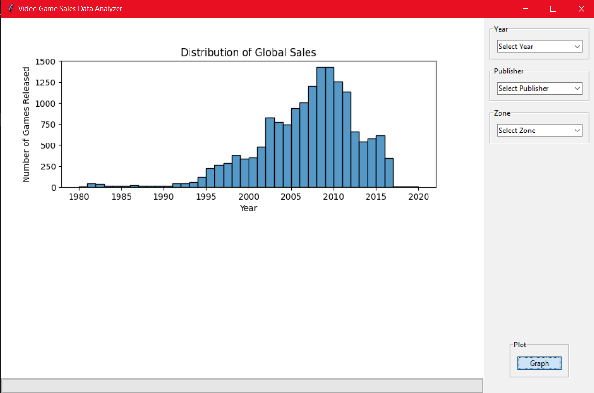
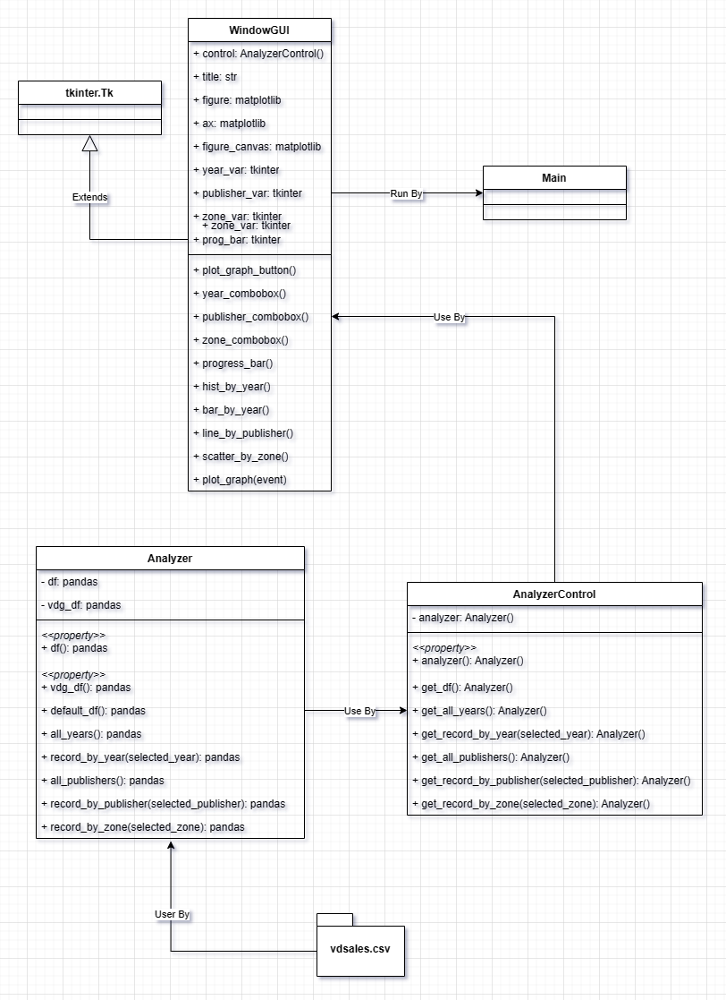
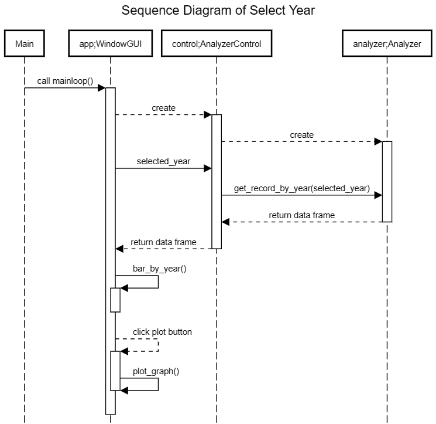

# Video Game Sales Analyzer
 
## Description
This application allows users to analyze video game sales data from 1980 to 2020. Please select the desired values from the provided comboboxes and click the "Graph" button to generate and visualize the corresponding graph. Please note that there may be missing data for certain years as the data source may not have records for those years.

This is the GUI of the application:


## Data Sources
This application exclusively utilizes the CSV file named ```vgsales.csv``` to analyze the data.

```vgsales.csv``` contains the sales records of video games, including information such as the publisher, genre, release year, and total sales in various regions from 1980 to 2020.

[Click here to see data source](https://www.kaggle.com/datasets/gregorut/videogamesales)
 
## Running the Application
Any dependencies (packages) needed to run your program and how to run it.
 
## Design
The design of this application allows users to determine how the data is visualized by selecting a value from a dropdown menu and clicking a button to generate the corresponding graph. The application also includes a progress bar to indicate that the application is functioning correctly. In the event that no value has been selected from the dropdown menu, users can still click the button to view the default graph provided by the application.

This is the UML Class Diagram of the application:


And this is the Sequence Diagram of the application:


## Design Patterns Used
* ***Facade Pattern***
    * I use this pattern to retrieve the data frame from the logic layer and return it to the presentation layer for plot the graph.
 
## Graph Algorithm Used
The part of the application that is modeled as a graph problem is finding the top influential games based on their sales performance across different platforms. This can be solved using the PageRank algorithm, which is a graph algorithm used to assign importance scores to vertices based on the structure of the graph and the weights of the edges.

To find the top influential games, the PageRank algorithm is applied to the graph. The algorithm works by iteratively assigning importance scores to each vertex based on the scores of its neighboring vertices. The process continues until convergence, where the scores stabilize.
 
## Other Information
Anything else you would like to include. Anything you think is important or interesting that you learned. For example, any interesting libraries or packages you use in your application.
